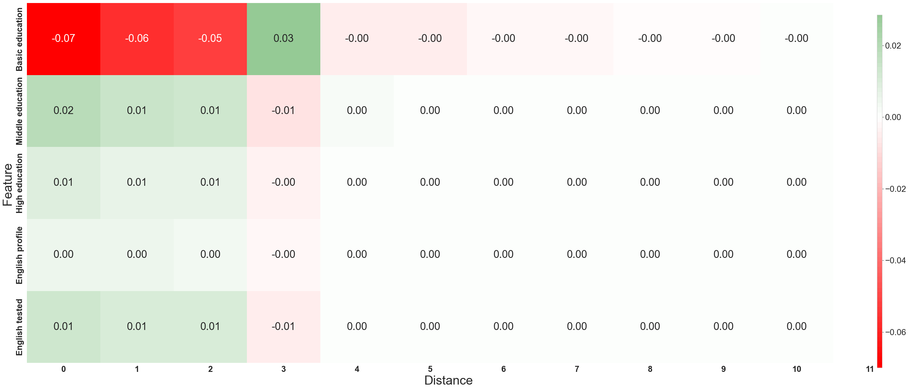
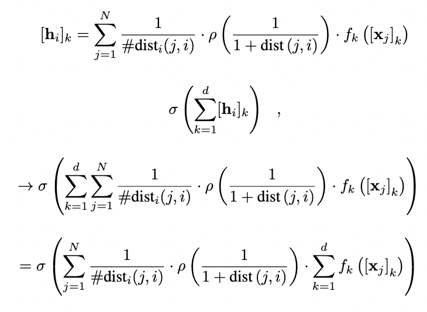

# GNAN - An Interpretable and Effective Graph Neural Additive Network

Now, you can have interpretability and accuracy at the same time when learning on graphs! 🤩 🤩 🤩 
GNAN is the first interpretable-by-design Graph Neural Network, delivering a white-box approach that matches the accuracy of top-performing black-box GNNs. By leveraging Generalized Additive Models and adapting them to graph data, GNAN allows you to visualize exactly what your model learns—offering transparent explanations for the model and its predictions, more effective debugging, and more informed model selection based on learned priors rather than guesswork. Paper and code in the first comment.

This repository contains the implementation of the Graph Neural Additive Networks (GNAN) as described in the paper [The Intelligible and Effective Graph Neural Additive Networks](https://arxiv.org/pdf/2406.01317).
Graph Neural Additive Networks (GNAN) are designed to be fully interpretable, providing both global and local explanations at the feature and graph levels through direct visualization of the model.


### Requirements
* Python 3.9
* PyTorch 1.0.0
* PyTorch Geometric 1.0.0
* scikit-learn 0.20.0
* numpy 1.15.4
* scipy 1.1.0
* pandas 0.23.4

# Run
To run an experiment, set the parameters in the run.sh file , then run bash run.sh
If you want to use GNAN for your own data or to edit it, you can copy the file GNAN.py. 
For running time and memory optimization, we recommend using TensorGNAN for node-level tasks, and GNAN for graph-level tasks.

# Note on the implementation
Certain operations are linear and can be rearranged, allowing us to select the order that results in the most efficient implementation. This order differs from the one presented in the paper, which is optimized for readability and ease of understanding. However, it is ensured that the computations produce the same function.



# Explanations
To visualize any component of GNAN, you can simply access its learned component as listed in the model definition in the GNAN.py file. You can evaluate these components on any input of interest.


# Citing
If you are using GNAN, please cite the following paper:
```
@misc{bechlerspeicher2024intelligibleeffectivegraphneural,
      title={The Intelligible and Effective Graph Neural Additive Networks}, 
      author={Maya Bechler-Speicher and Amir Globerson and Ran Gilad-Bachrach},
      year={2024},
      eprint={2406.01317},
      archivePrefix={arXiv},
      primaryClass={cs.LG},
      url={https://arxiv.org/abs/2406.01317}, 
}
```

# Help Imprving GNAN
If you are intersted in assisting in improving and extending GNAN, e.g. by interating it into PyG, please contact Maya Bechler-Speicher at mayab4 [at] mail [dot] tau  [dot] ac  [dot] il

